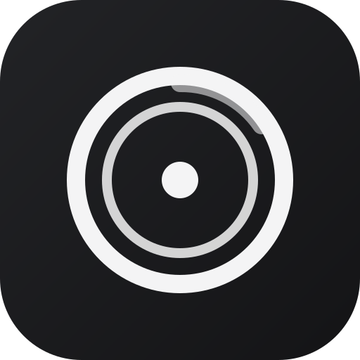

<p align="center">
  
</p>

<h1 align="center">Chronoval</h1>

<p align="center">
  自托管的个人摄影画廊 · 基于 Nuxt 4 的全栈单体应用，一个容器同时提供页面与 API。
</p>

<p align="center">
  
  
  
  
  
  
</p>

极简暗色 · 高斯模糊 · WebGL 高性能图片查看器（灵感 Afilmory，查看器承自 ChronoFrame）。

## 特性

- **本地目录即存储**：照片/视频放进映射目录即自动识别、生成缩略图，无需后台上传；原文件只读挂载，绝不加密或改写
- **本地扫描库**：按文件夹管理外部相册，缩略图就地生成，与加密上传完全分离、统一首页画廊
- **查看与分享**：WebGL 缩放平移、Exif 面板、分享链接 / 嵌入代码 / 原生 Web Share / 下载原图
- **多格式**：JPEG / PNG / WebP / GIF / TIFF / HEIC / MOV / MP4，Live Photo 自动配对
- **地图浏览**：MapLibre / Mapbox 聚合拍摄位置，反向地理编码识别城市
- **管理后台**：相册 / 上传队列 / 实时日志 / 系统监控 / 日历热图

## 快速开始

```bash
# 1. 复制环境变量模板
cp .env.example .env

# 2. 建好媒体库目录
mkdir -p data/storage/photos data/storage/videos

# 3. 启动（默认拉取 ghcr.io/xiaomengr/chronoval:latest 镜像）
docker compose up -d

# 4. 打开 http://localhost:3000，按向导设置管理员
```

媒体库照片放入 `data/storage/photos`、视频放入 `data/storage/videos` 即被自动识别。

> 想用固定版本，将 `docker-compose.yml` 的 `image` 改为 `ghcr.io/xiaomengr/chronoval:1.0.0.4`。
> 从源码自己编译时才用 `docker compose up -d --build`。

## 文档导航

| 主题 | 说明 | 文档 |
| --- | --- | --- |
| 一分钟启动 | 面向同事的极简 3 步部署 | [docs/quickstart-deploy.md](docs/quickstart-deploy.md) |
| 快速上手 | 安装、配置、升级 | [docs/guide/getting-started.md](docs/guide/getting-started.md) |
| 部署指南 | Docker / 镜像 / 目录映射 / 备份 | [docs/deployment.md](docs/deployment.md) |
| 独立 IP 访问 | macvlan 网络，容器拥有专属 IP | [docs/zh/guide/deploy-ip.md](docs/zh/guide/deploy-ip.md) |
| 本地扫描库 | 按文件夹管理外部相册 | [docs/zh/guide/scan-library.md](docs/zh/guide/scan-library.md) |
| 环境变量 | 全部配置参考 | [docs/configuration.md](docs/configuration.md) |
| 存储提供方 | 本地 / S3 / OpenList | [docs/configuration/storage-providers.md](docs/configuration/storage-providers.md) |
| 本地开发 | 开发环境与项目结构 | [docs/development/quickstart.md](docs/development/quickstart.md) |
| 用户指南 | 安装 / 升级 / 隐藏功能 | [docs/guide/updates.md](docs/guide/updates.md) |
| 完整文档站 | 全部文档索引 | [docs/index.md](docs/index.md) |

> 镜像通过内置 **GitHub Actions** 自动构建并推送至 **GHCR**：`ghcr.io/xiaomengr/chronoval:latest`（最新代码），稳定版 `ghcr.io/xiaomengr/chronoval:1.0.0.4`。`docker compose up -d` 或 `docker pull` 即可获取。

## 许可证

[MIT](LICENSE)

> 本项目基于 [ChronoFrame](https://github.com/HoshinoSuzumi/chronoframe)（MIT）定制改造，视觉与部分交互参考 [Afilmory](https://github.com/Afilmory/Afilmory)。致谢原作者。